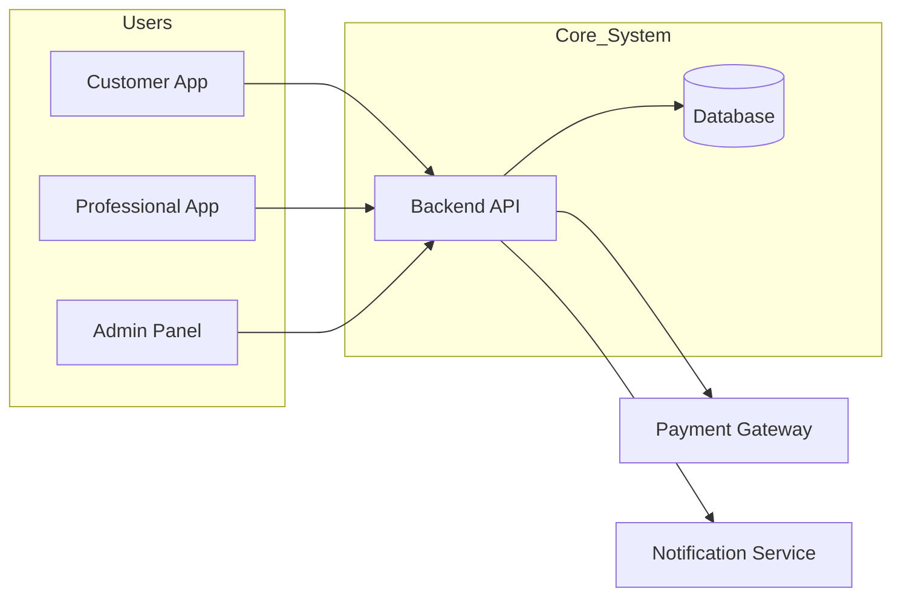
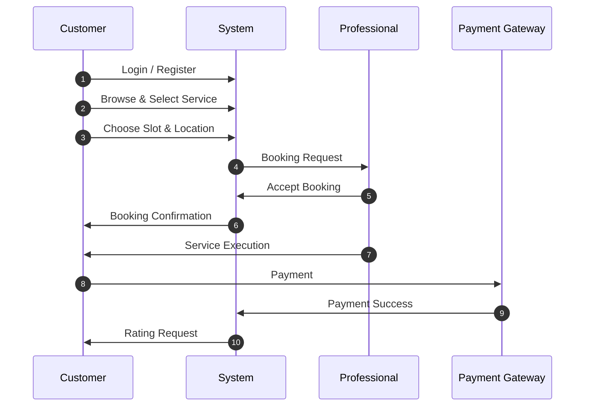
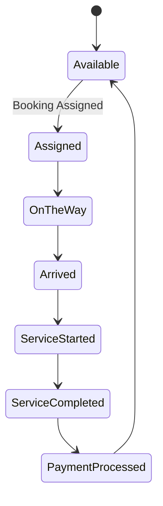
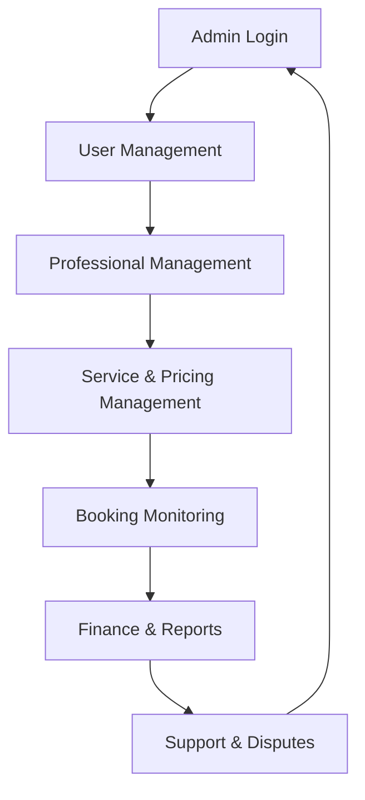
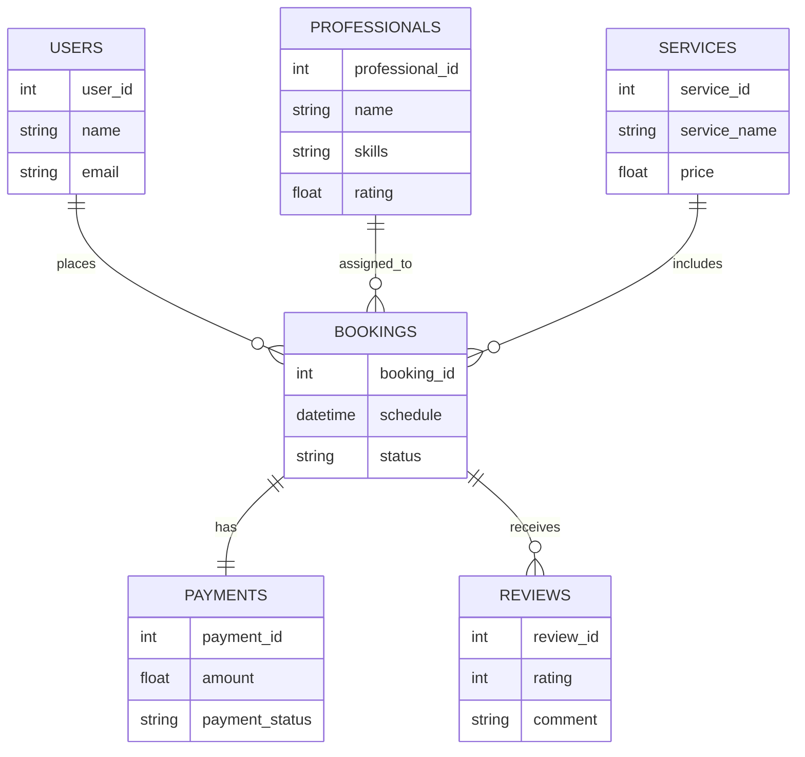

## 1. System Architecture

```mermaid
graph LR
    subgraph Users
        C[Customer App]
        P[Professional App]
        A[Admin Panel]
    end

    subgraph Core_System
        B[Backend API]
        D[(Database)]
    end

    PG[Payment Gateway]
    N[Notification Service]

    C --> B
    P --> B
    A --> B

    B --> D
    B --> PG
    B --> N
```

----

## 2. Booking Workflow

```mermaid
sequenceDiagram
    autonumber
    participant C as Customer
    participant S as System
    participant P as Professional
    participant PG as Payment Gateway

    C->>S: Login / Register
    C->>S: Browse & Select Service
    C->>S: Choose Slot & Location
    S->>P: Booking Request
    P->>S: Accept Booking
    S->>C: Booking Confirmation
    P->>C: Service Execution
    C->>PG: Payment
    PG->>S: Payment Success
    S->>C: Rating Request
    
```

---

## 3. Professional Service Execution Flow

```mermaid
stateDiagram-v2
    [*] --> Available
    Available --> Assigned : Booking Assigned
    Assigned --> OnTheWay
    OnTheWay --> Arrived
    Arrived --> ServiceStarted
    ServiceStarted --> ServiceCompleted
    ServiceCompleted --> PaymentProcessed
    PaymentProcessed --> Available

```

---

## 4. Admin Operations Flow

```mermaid
graph TD
    A[Admin Login]
    B[User Management]
    C[Professional Management]
    D[Service & Pricing Management]
    E[Booking Monitoring]
    F[Finance & Reports]
    G[Support & Disputes]

    A --> B
    B --> C
    C --> D
    D --> E
    E --> F
    F --> G
    G --> A
```

---

## 5. Database ER Diagram

```mermaid
erDiagram
    USERS ||--o{ BOOKINGS : places
    PROFESSIONALS ||--o{ BOOKINGS : assigned_to
    SERVICES ||--o{ BOOKINGS : includes
    BOOKINGS ||--|| PAYMENTS : has
    BOOKINGS ||--o{ REVIEWS : receives

    USERS {
        int user_id
        string name
        string email
    }

    PROFESSIONALS {
        int professional_id
        string name
        string skills
        float rating
    }

    SERVICES {
        int service_id
        string service_name
        float price
    }

    BOOKINGS {
        int booking_id
        datetime schedule
        string status
    }

    PAYMENTS {
        int payment_id
        float amount
        string payment_status
    }

    REVIEWS {
        int review_id
        int rating
        string comment
    }
```
